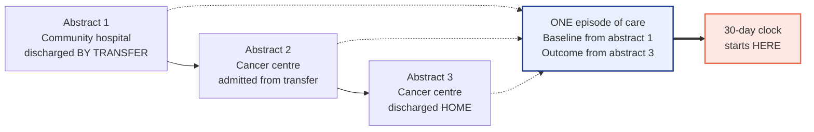
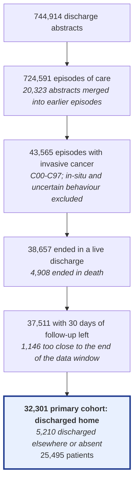
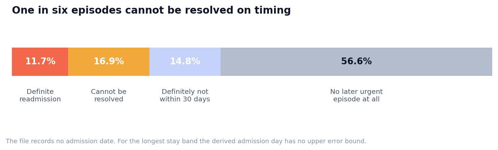
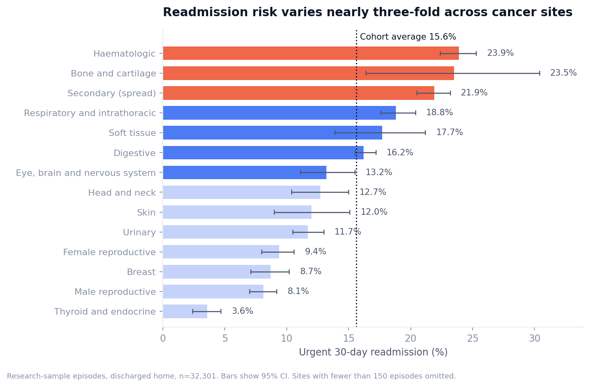
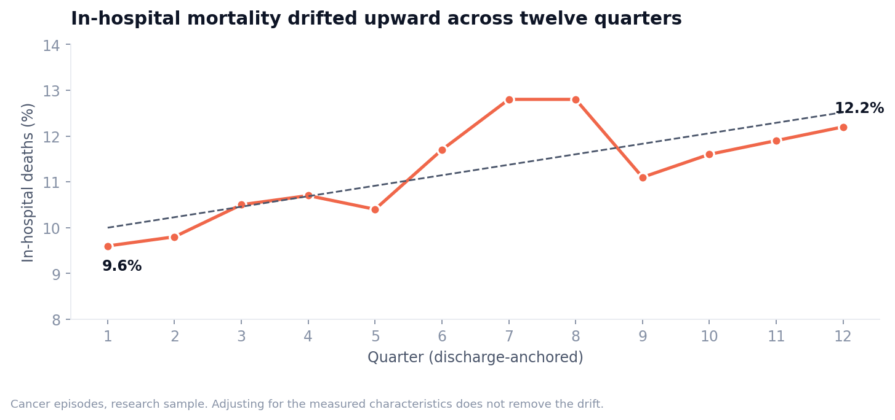
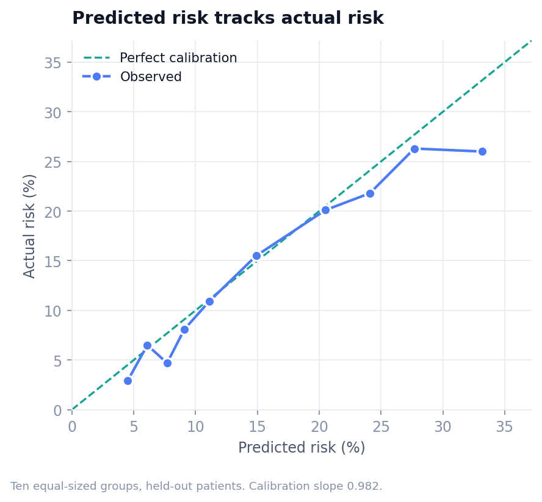
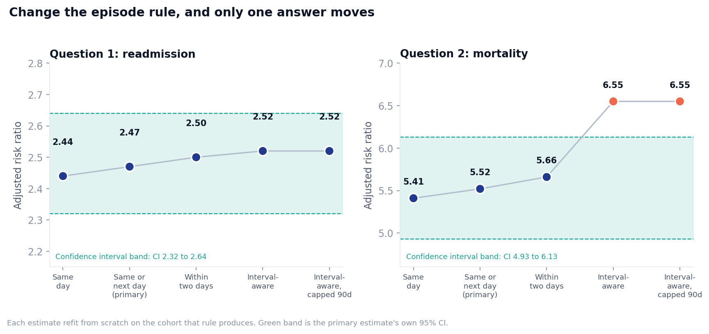
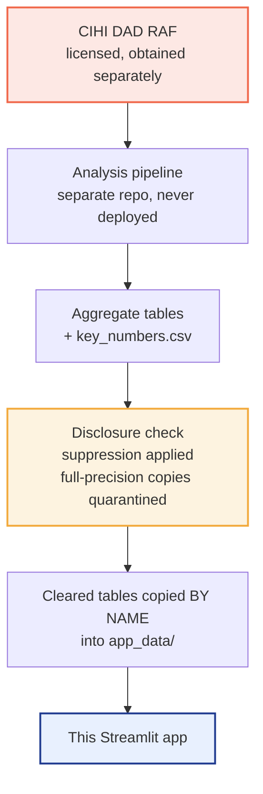

# Urgent readmission and in-hospital mortality after cancer hospitalisation

A retrospective cohort study of transfer-linked hospital episodes of care, built from the CIHI
Discharge Abstract Database Research Analytic File, with a Streamlit dashboard for the results.

**[Live dashboard →](https://cihi-cancer-readmission.streamlit.app/)**


> Parts of this material are based on the Canadian Institute for Health Information Discharge
> Abstract Database Research Analytic Files (sampled from fiscal years 2021-2022, 2022-2023 and
> 2023-2024). However the analysis, conclusions, opinions and statements expressed herein are
> those of the author and not those of the Canadian Institute for Health Information.

That wording is required and is reproduced without modification here, on the dashboard's
*Methods, data and licensing* page, and in the footer of every page. The CIHI logo is not used.

---

## What this is about

Someone finishes a cancer hospitalisation, goes home, and two weeks later they're back through
the emergency department. How often does that happen, and was there anything in the record of the
first stay that would have told you?

I went looking in a research sample of Canadian hospital discharge records. About one in six
people discharged home after a cancer hospitalisation came back urgently within 30 days. People
whose first stay had itself begun urgently came back at roughly two and a half times the rate of
people admitted in a planned way, and that gap survives adjustment for age, sex, cancer site,
whether the cancer had spread, and comorbidity count.

Getting there took longer than the analysis did, because the data doesn't hand you a hospital
stay. It hands you discharge abstracts, and one stay can be several of them. Most of what follows
is about that problem and what it does to the answers.

**Contents:** [the data](#the-data) · [building an episode](#building-an-episode-of-care) ·
[the cohort](#who-ended-up-in-the-study) · [the admission-date problem](#the-admission-date-problem) ·
[findings](#finding-1-how-often-people-come-back) · [prediction](#can-you-predict-it) ·
[robustness](#what-happens-if-you-change-the-rules) · [limitations](#what-this-cant-tell-you) ·
[disclosure](#disclosure-and-what-gets-published) · [running it](#running-it-yourself)

---

## What it isn't

Worth getting out of the way early, because the topic invites misreading.

This is not clinical decision support. There's no way to enter patient characteristics and get a
personalised risk, and nothing here has undergone prospective clinical validation. It isn't a
national estimate either — every count is a count inside this research sample. It's also not
CIHI's official 30-day readmission indicator, which uses its own episode construction,
denominators and exclusions. The outcome here is project-defined.

The data is not open data, not Alberta Health Services data, not Alberta Health data, not Cancer
Care Alberta production data, and not health-system production data.

And nothing here is causal. Urgent admission is a marker of how an episode began, not a treatment
anyone assigned.

---

## The data

Canadian Institute for Health Information, Discharge Abstract Database, Research Analytic File,
clinical research sample, sampled from fiscal years 2021-2022, 2022-2023 and 2023-2024. Coverage
is Canadian provinces and territories excluding Quebec, at approximately a 10% research sample of
discharge abstracts. Rates and percentages describe that sample. The counts are not Canadian
national totals.

Each row is a discharge abstract: one patient, one stay, one facility, with diagnoses,
interventions, a discharge disposition, and a patient identifier that persists across stays. The
unit of analysis here isn't the abstract though. It's the approximated episode of care, meaning
one or more abstracts joined where the coding indicates a transfer between facilities.

### Getting the data yourself

The file was accessed through the University of Alberta's institutional access under Statistics
Canada's Data Liberation Initiative arrangement. The RAF is licensed, not public, and it is not in
this repository.

1. Confirm your institution participates in Statistics Canada's Data Liberation Initiative.
2. Contact your institution's DLI contact or data librarian and request the CIHI DAD Research
   Analytic File for the fiscal years you need.
3. Obtain the file under your own institution's Terms. It can't be redistributed by this project,
   and no part of it is reachable from this repository or the deployed application.
4. Check with the same contact before publishing any derived output of your own.

No credentials of any kind belong in this repository — no institutional login, no CCID, no
password, no access token, no cookies, no library session information. The application never
touches the restricted data, so deployment secrets should contain no data-access credentials at
all.

---

## Building an episode of care

Here's the problem that shapes everything downstream. When a hospital transfers a patient
somewhere else, the system writes a second abstract. Count abstracts and that transfer looks
exactly like a readmission — same patient, new admission, a couple of days later. It isn't one.
It's the middle of a single continuous stay.



Two abstracts get joined when the discharge coding says transfer and the timing is compatible.
Under the primary rule that means the receiving stay began the same day as the sending discharge,
or the day after.

A few other decisions follow from treating the episode as the unit. Baseline characteristics come
from the first abstract only, and this one is easy to get wrong. A condition that develops at the
first hospital gets coded as *present on admission* at the second, so aggregating diagnoses across
the whole episode quietly turns complications from early in the stay into baseline
characteristics, and the model ends up adjusting for its own outcome.

Comorbidities come from diagnosis type 1 only, for the same reason. Type 2 conditions are recorded
as arising after admission, and including them leaks the outcome into the predictors.

Baseline-only models are the primary ones. Palliative care, post-admission conditions, special
care, length of stay, procedures, multi-facility care — all of it happens after the exposure.
Models including those variables are reported, but as descriptive, answering a different question
rather than a better-adjusted version of the same one.

Time periods are anchored on discharge rather than admission, which the next section explains.

---

## Who ended up in the study



Research-sample counts throughout, not national totals.

Notice that 32,301 episodes come from 25,495 patients. People contribute more than one episode,
which is why every confidence interval here uses a patient-cluster bootstrap, and why the
train/test split for the prediction model is by patient rather than by episode.

---

## The admission-date problem

The file has no admission date. It has a discharge day and a length-of-stay band: 1 day, 2 days,
3 days, 4 to 5, 6 to 9, or 10 or more.

So the admission day gets derived as discharge day minus the floor of the band. For short stays
that's exact. For the "10 or more" band it's barely a bound at all — a 10-day stay and a 300-day
stay both get their admission placed 10 days before discharge.

Which matters enormously for a 30-day window. Sometimes the possible range of admission days sits
entirely inside it and the readmission is provable. Sometimes it sits entirely outside. And
sometimes it straddles the boundary and there's no answer to be had.



The ambiguous cases could have been assigned one way or the other and nobody would have noticed.
Instead the share is reported: roughly one in six episodes can't be resolved. Every headline figure
comes with a complete-case sensitivity analysis that drops them entirely.

There's a subtler version of the same problem, which the robustness section comes back to.
Transfer merging fails more often for long stays, and long stays aren't independent of how sick
someone is. So the leftover error isn't sprinkled evenly across the cohort. It's correlated with
the exposure being studied.

---

## Finding 1: how often people come back

Of 32,301 episodes ending in a discharge home, 5,027 were followed by an urgent or emergent
readmission within 30 days. That's 15.6%.

It's nowhere near uniform:



Haematologic cancers, bone and cartilage, and secondary (spread) all sit above 21%. Thyroid and
endocrine, male reproductive and breast sit below 9%. Nearly a three-fold spread, worth remembering
whenever someone quotes a single readmission figure for cancer care generally.

The comparison this study is actually built around is how the index episode began. Adjusting for
age band, sex, cancer site, spread and comorbidity count:

| | Adjusted 30-day readmission risk |
|---|---|
| Index episode began urgently | 22.3% |
| Index episode was planned | 9.0% |
| Risk ratio | **2.47** (95% CI 2.32 to 2.64) |
| Risk difference | 13.3 percentage points |
| Odds ratio | 2.94 |

Two and a half times. But urgent admission is a marker here, not a cause — whatever sent someone in
urgently the first time is plausibly still going on when they're discharged, and most of it isn't
written down anywhere in this file.

---

## Finding 2: urgent admission and in-hospital death

Same comparison, different outcome, wider population: all 43,565 cancer episodes rather than only
those discharged home.

| | Adjusted in-hospital mortality |
|---|---|
| Urgent admission | 16.0% |
| Planned admission | 2.9% |
| Risk ratio | **5.52** (95% CI 4.93 to 6.13) |

A risk ratio above five is a big number and it would make a good headline. I'd hold off, for
reasons in the robustness section. This is the least stable of the four findings.

---

## Finding 3: conditions recorded as arising after admission

Diagnosis type 2 marks a condition recorded as arising after admission. It shows up in 23.7% of
cancer episodes, and what it travels with is striking:

| | No type 2 condition coded | At least one coded |
|---|---|---|
| Episodes | 33,235 | 10,330 |
| Died in hospital | 9.0% | 18.7% |
| Special care unit | 8.1% | 24.0% |
| Long stay | 39.6% | 81.9% |

Strong and consistent, and not interpretable in one direction. A condition arising after admission
may well worsen the outcome. A long, complicated stay also gives far more opportunity for
conditions to get recorded in the first place. Both are happening at once and this file can't pull
them apart.

---

## Finding 4: a drift adjustment doesn't explain

In-hospital mortality among cancer episodes rose across the twelve quarters, 9.6% to 12.2%.



Obvious next question: did the cohort just get sicker? So the trend was refit three ways.

| Model | Odds ratio per quarter |
|---|---|
| Time only | 1.0225 |
| Time plus measured characteristics | 1.0234 |
| Time plus measured characteristics and COVID coding | 1.0228 |

Adjusting for everything measurable doesn't remove the drift. If anything it nudges it up slightly.
The conclusion has to stay narrow: the characteristics recorded in this file don't explain the
change. Whatever did is outside what the DAD can tell you.

---

## Can you predict it?

If readmission is that much more common in some groups, can you flag it at discharge?

The model predicts urgent 30-day readmission from information available at the end of the index
stay. It's a discharge-time research model, not an admission-time clinical tool, and it isn't
clinical decision support.

| Metric | Value |
|---|---|
| AUC, logistic | 0.697 (0.682 to 0.709) |
| Geographic holdout, Alberta, patient-separated | 0.687 (0.663 to 0.709) |
| PR-AUC | 0.244, against an outcome prevalence of 0.143 |
| Brier score | 0.1158 |
| Calibration slope | 0.982 |



Discrimination and calibration are different things, and this model is much better at the second
than the first. An AUC near 0.70 means it can't reliably tell you which individual comes back. The
calibration slope of 0.982 means that when it says a group carries 25% risk, that group really does
come back about 25% of the time. For population-level planning the second property is the one you
want, though it's the first that usually gets quoted.

The Alberta result is an internal geographic split within the same file. It is not external
validation, and no external validation has been done.

---

## What happens if you change the rules

This is the part I'd want a reviewer to look at.

The transfer rule decides where one episode ends and the next begins, and there's no single correct
answer — only defensible options. Rather than pick one and defend it, every headline estimate was
refit from scratch on the cohort each rule produces.



| Transfer rule | Cohort | Readmission | Q1 risk ratio | Q2 risk ratio |
|---|---|---|---|---|
| Same-day transfer | 32,222 | 15.55% | 2.44 | 5.41 |
| **Same or next day (primary)** | **32,301** | **15.56%** | **2.47** | **5.52** |
| Within two days | 32,350 | 15.58% | 2.50 | 5.66 |
| Interval-aware (earliest possible admission) | 32,644 | 15.58% | 2.52 | 6.55 |
| Interval-aware, 10+ band capped at 90 days | 32,595 | 15.59% | 2.52 | 6.55 |

Question 1 holds up well. The risk ratio moves by 0.08 across every rule, comfortably inside its own
confidence interval of 2.32 to 2.64, and the readmission rate barely moves at all. Whichever rule
you pick, you get the same answer.

Question 2 doesn't. Its risk ratio moves by 1.14, which is roughly the width of its own confidence
interval. So for the mortality comparison, choosing an episode definition carries about as much
uncertainty as sampling does, and the confidence interval on its own understates how well 5.52 is
pinned down.

That's an awkward thing to print underneath a risk ratio of 5.52. It's also the whole point of
running the analysis, so it's printed.

---

## What this can't tell you

| | |
|---|---|
| Inpatient care only | No outpatient care, and no emergency department visit that didn't end in an admission |
| Deaths after discharge are unobserved | Mortality is in-hospital only, so death after discharge is an unobserved competing event for readmission |
| No cancer stage | Stage, exact diagnosis date and performance status aren't in the DAD, so severity is only partly captured |
| Quebec is absent | "Provinces" here means the rest of Canada |
| A research sample, not a census | Approximately 10% of abstracts; sample counts are not Canadian national totals |
| Banded age and length of stay | Both arrive banded, so models use bands rather than continuous values |
| Timing isn't always resolvable | See the certainty chart above |
| Episodes are approximations | Transfer-linked episodes approximate episodes of care from the fields available in the RAF. They are not CIHI's official episode methodology |
| Transfer-linking error is differential | Merging fails more often for long receiving stays, and long stays aren't independent of severity, so the residual error correlates with the exposure |
| Patients contribute several episodes | Intervals use a patient-cluster bootstrap, but the unit of analysis is the episode |
| Observational throughout | Urgent admission is a marker of how the episode began, not an assigned intervention, and the unmeasured severity that sends someone in urgently is plausibly related to the outcome too |

---

## Disclosure and what gets published



Only derived aggregate tables are deployed with the application, from an explicit allow-list rather
than a directory scan. No record-level file, analysis database, internal full-precision table or
CIHI documentation is in the repository, and none is reachable from the running app. The copy step
into `app_data/` is deliberate and manual — the application never points at the analysis output
directory.

Suppression is carried in the source tables and never reversed in the dashboard. A withheld value
shows as *Suppressed*, stays out of every chart, and is never recoverable by subtracting the visible
rows from a total. `small_cell_report.csv` lists every suppressed row and the reason.

One thing to be precise about: the rule that produced those withheld cells is the project's own
conservative safeguard. The CIHI and DLI Terms available to this project state no numeric threshold,
so nothing here should be read as a CIHI-mandated minimum cell size. The application adds no
threshold of its own, the cleared tables govern, and any change to the rule should come from the
institutional DLI contact.

Filtering in the dashboard only switches between tables that were aggregated and cleared in advance.
There's deliberately no cross-tabulation of province by site by age by quarter, because combining
otherwise-safe aggregates can produce a cell nobody cleared. No record-level data is queried at any
point.

Two build-time checks guard the numbers in the written reports. The document builder pulls every
figure from `key_numbers.csv` and raises on a missing entry, and a verification step reads the
finished documents back and fails the build if any number in them can't be traced to an analysis
output.

---

## Running it yourself

```bash
git clone <this-repository>
cd cihi-cancer-readmission/dashboard
python -m venv .venv && source .venv/bin/activate    # Windows: .venv\Scripts\activate
pip install -r requirements.txt
streamlit run app.py
```

No data setup needed. The cleared aggregate tables ship in `app_data/` and the app never reads the
licensed file.

`requirements.txt` pins Streamlit to the 1.64 line deliberately. Some of the CSS targets Streamlit's
internal markup, which moves between minor releases.

```bash
python tools/check_release.py    # pre-deployment repository check
python tools/smoke_test.py       # runs every page through Streamlit's test harness
```

---

## How the code is organised

```
analysis/
    scripts/            pipeline, 00 to 15, run in order
    sql/                episode reshaping and cohort construction
    reference/          cancer scope and site mapping
    public_outputs/     cleared aggregate tables

dashboard/
    app.py              navigation only
    pages/              the eight dashboard pages
    assets/
        styles.css      design tokens, cards, motion, responsive rules
        motion.js       scroll-triggered chart reveal, presentation only
    src/
        constants.py    chart palette, ordering, terminology, the allow-list
        data_loader.py  allow-listed loading, schema validation, caching
        charts.py       every figure; returns Plotly objects, calls no st.*
        metrics.py      lookups into key_numbers.csv
        formatting.py   numbers, intervals, model-label tidying
        ui.py           hero, KPI cards, finding cards, chart cards, callouts
        art.py          decorative page-header scene, no data
        licensing.py    attribution, access and release wording
    app_data/           cleared aggregate tables only
    tools/              release check and smoke test
    requirements.txt

docs/img/               figures used in this README
.streamlit/config.toml
```

The interface is a small design system rather than default Streamlit. Tokens live in
`assets/styles.css`, the components using them live in `src/ui.py`, and the chart half of the same
palette sits in `src/constants.py` and gets applied centrally in `src/charts.py`. Charts return
Plotly objects and never call Streamlit directly, so they're testable on their own. The JavaScript
in `motion.js` handles scroll-triggered reveals and touches no data.

Built with Streamlit and Plotly, plus custom CSS and a little JavaScript. The analysis pipeline
behind it uses pandas, DuckDB, statsmodels and scikit-learn.

---

## Citation and attribution

If you refer to this work, please reproduce the CIHI accreditation statement at the top of this
README without modification, and note that the analysis, conclusions, opinions and statements are
the author's own.

Application code here may be reused under the terms in `LICENSE`. That licence covers the code only.
It does not extend to the CIHI Discharge Abstract Database Research Analytic Files, which remain
licensed separately and must be obtained through an eligible institutional DLI arrangement.
