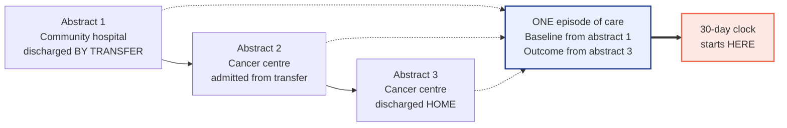
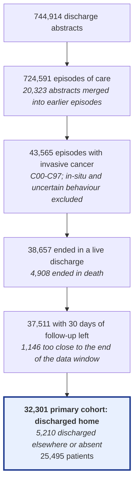
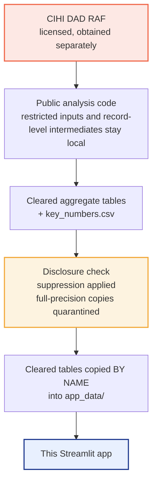

# Urgent readmission and in-hospital mortality after cancer hospitalisation

A retrospective cohort study of transfer-linked hospital episodes of care, built from the CIHI
Discharge Abstract Database Research Analytic File, with a Streamlit dashboard for the results.

**[Live dashboard →](https://cihi-cancer-readmission.streamlit.app/)**


**Deployment runtime:** Python 3.13. I kept the existing badge link unchanged.

> Parts of this material are based on the Canadian Institute for Health Information Discharge
> Abstract Database Research Analytic Files (sampled from fiscal years 2021-2022, 2022-2023 and
> 2023-2024). However the analysis, conclusions, opinions and statements expressed herein are
> those of the author and not those of the Canadian Institute for Health Information.

That wording is required and is reproduced without modification here, on the dashboard's
*Methods, data and licensing* page, and in the footer of every page. The CIHI logo is not used.

---

## What this is about

For this project, I wanted to look at what happens after a cancer hospitalisation ends in discharge
home: how often is there an urgent or emergent readmission within 30 days, and what information from
the index stay is associated with that outcome?

In this research sample, 15.6% of eligible episodes ending in discharge home were followed by an
urgent/emergent readmission within 30 days. After adjustment for age, sex, cancer site, spread and
comorbidity count, the standardized readmission risk was 22.3% for urgent index admissions and 9.0%
for planned admissions, giving a risk ratio of 2.47. This is an association, not a causal effect.

A major part of the project was defining the unit of analysis correctly. The source file contains
discharge abstracts rather than ready-made episodes of care, and one continuous hospital stay can
produce more than one abstract. That is why episode construction and transfer handling are a large
part of the methodology below.

**Contents:** [the data](#the-data) · [building an episode](#building-an-episode-of-care) ·
[the cohort](#who-ended-up-in-the-study) · [the admission-date problem](#the-admission-date-problem) ·
[findings](#finding-1-how-often-people-come-back) · [prediction](#can-you-predict-it) ·
[robustness](#what-happens-if-you-change-the-rules) · [limitations](#what-this-cant-tell-you) ·
[disclosure](#disclosure-and-what-gets-published) · [running it](#running-it-yourself)

---

## What this project is not

A few boundaries are important when interpreting the results.

This is not clinical decision support. The dashboard does not generate a personalised patient risk,
and the model has not undergone prospective clinical validation. The results are also not national
estimates: every count comes from this research sample. The project-defined readmission outcome is
not CIHI's official 30-day readmission indicator, which uses its own episode construction,
denominators and exclusions.

The data is not open data, not Alberta Health Services data, not Alberta Health data, not Cancer
Care Alberta production data, and not health-system production data.

The analysis is observational throughout. Urgent admission describes how an episode began; it is
not an assigned treatment, so these results should not be interpreted causally.

---

## The data

Canadian Institute for Health Information, Discharge Abstract Database, Research Analytic File,
clinical research sample, sampled from fiscal years 2021-2022, 2022-2023 and 2023-2024. Coverage
is Canadian provinces and territories excluding Quebec, at approximately a 10% research sample of
discharge abstracts. Rates and percentages describe that sample. The counts are not Canadian
national totals.

Each row is a discharge abstract: one patient, one stay, one facility, with diagnoses,
interventions, a discharge disposition, and a patient identifier that persists across stays. The
unit of analysis here isn't the abstract though. It's the approximated episode of care, meaning
one or more abstracts joined where the coding indicates a transfer between facilities.

### Getting access to the data

I accessed the file through the University of Alberta's institutional access under Statistics
Canada's Data Liberation Initiative arrangement. The RAF is licensed, not public, and it is not in
this repository.

1. Confirm your institution participates in Statistics Canada's Data Liberation Initiative.
2. Contact your institution's DLI contact or data librarian and request the CIHI DAD Research
   Analytic File for the fiscal years you need.
3. Obtain the file under your own institution's Terms. It cannot be redistributed by this project,
   and no part of it is reachable from this repository or the deployed application.
4. Check with the same contact before publishing any derived output of your own.

No credentials are included in this repository: no institutional login, CCID, password, access
token, cookies or library session information. The application never reads the restricted data, so deployment secrets should contain no data-access credentials at
all.

---

## Building an episode of care

One of the main data challenges was handling transfers between facilities. A transfer can create a
new discharge abstract even though the patient is still in the same continuous episode of care. If
we counted abstracts directly, some transfers could therefore be mistaken for readmissions.



We join two abstracts when the discharge coding says transfer and the timing is compatible.
Under the primary rule, this means the receiving stay began the same day as the sending discharge,
or the day after.

A few other decisions follow from treating the episode as the unit. Baseline characteristics for
the association models come from the first abstract only. A condition that develops at the first
hospital can be coded as *present on admission* at a receiving hospital, so aggregating diagnoses
across the full transfer-linked episode can move post-exposure information into a baseline
covariate.

Comorbidities therefore come from diagnosis type 1 on the first abstract for the baseline models.
Type 2 conditions are recorded as arising after admission and are not treated as baseline
characteristics.

Baseline-only models are the primary association models. Palliative care, post-admission
conditions, special care, length of stay, procedures and multi-facility care occur during the
episode, so models that add them are reported as descriptive rather than as better-adjusted versions
of the same question. The separate prediction model is different by design: it is explicitly a
**discharge-time/end-of-index-stay research model**, so it intentionally uses information available
by the end of the stay.

Time periods are anchored on discharge rather than admission, which the next section explains.

---

## Who ended up in the study



Research-sample counts throughout, not national totals.

The 32,301 episodes in the primary cohort came from 25,495 patients, so some patients contributed
more than one episode. Rate and prediction-performance intervals therefore use patient-level
resampling, regression models use patient-cluster robust covariance where applicable, and the
prediction train/test split is made at the patient level rather than the episode level.

---

## The admission-date problem

The RAF does not provide an exact admission date. It has a discharge day and a length-of-stay band: 1 day, 2 days,
3 days, 4 to 5, 6 to 9, or 10 or more.

We therefore derive the admission day as discharge day minus the floor of the length-of-stay band.
For the shorter bands this is exact, but for the "10 or more" category it only gives a lower bound
on length of stay. A 10-day stay and a much longer stay are both placed 10 days before discharge.

This matters for a 30-day readmission window. In some cases the possible admission interval is
fully inside the window, in some cases it is fully outside, and in other cases it crosses the
boundary so the exact timing cannot be resolved from the available fields.


Rather than forcing the ambiguous cases into one category, we report them separately: roughly one
in six primary-cohort episodes cannot be resolved on urgent-readmission timing. The readmission
analysis therefore includes a complete-case sensitivity analysis that excludes those episodes.

A related issue is transfer linkage, which is examined again in the robustness section. Transfer
merging is less successful for long receiving stays, and long stays are related to illness severity.
This means the remaining linkage error may not be evenly distributed across the cohort.

---

<a id="finding-1-how-often-people-come-back"></a>
## Finding 1: 30-day urgent readmission

Of 32,301 episodes ending in a discharge home, 5,027 were followed by an urgent or emergent
readmission within 30 days. That's 15.6%.

Rates differed across cancer sites:


Among cancer-site groups with at least 200 episodes, haematologic cancers and secondary (spread)
were above 21%, while thyroid and endocrine, male reproductive and breast were below 9%. These are
descriptive group rates rather than adjusted site effects, so the overall 15.6% should be read as a
cohort average rather than a rate that applies equally across cancer groups.

The main adjusted comparison asks whether readmission differed according to how the index episode
began. Adjusting for
age band, sex, cancer site, spread and comorbidity count:

| | Adjusted 30-day readmission risk |
|---|---|
| Index episode began urgently | 22.3% |
| Index episode was planned | 9.0% |
| Risk ratio | **2.47** (95% CI 2.32 to 2.64) |
| Risk difference | 13.3 percentage points |
| Odds ratio | 2.94 |

Urgent index admission was therefore associated with a substantially higher adjusted readmission
risk. This should not be interpreted causally, because the factors that lead to an urgent admission
may also be related to later readmission and are only partly measured in the RAF.

---

## Finding 2: urgent admission and in-hospital death

For the mortality analysis, we use all 43,565 cancer episodes rather than only the episodes ending
in discharge home.

| | Adjusted in-hospital mortality |
|---|---|
| Urgent admission | 16.0% |
| Planned admission | 2.9% |
| Risk ratio | **5.52** (95% CI 4.93 to 6.13) |

This association is large, but it is also more sensitive to the transfer-linkage rule than the Q1
readmission comparison. That sensitivity is shown in the robustness section.

---

## Finding 3: conditions recorded as arising after admission

Diagnosis type 2 marks a condition recorded as arising after admission. At least one such condition
was present in 23.7% of cancer episodes. Those episodes also had higher crude mortality, special-care
use and long-stay frequency:

| | No type 2 condition coded | At least one coded |
|---|---|---|
| Episodes | 33,235 | 10,330 |
| Died in hospital | 9.0% | 18.7% |
| Special care unit | 8.1% | 24.0% |
| Long stay | 39.6% | 81.9% |

These are descriptive associations. A condition arising after admission may be related to worse
outcomes, while longer and more complex stays also create more opportunity for conditions to be
recorded. The available data cannot separate those mechanisms.

---

## Finding 4: mortality over time

In-hospital mortality was 9.6% in quarter 1 and 12.2% in quarter 12, but the observed series was
non-monotonic. It peaked at 12.8% in quarters 7 and 8, fell to 11.1% in quarter 9, and then rose
again.


We then tested whether adjustment for measured characteristics changed the fitted time association.
The model was estimated three ways.

| Model | Odds ratio per quarter |
|---|---|
| Time only | 1.0225 |
| Time plus measured characteristics | 1.0234 |
| Time plus measured characteristics and COVID coding | 1.0228 |

The fitted per-quarter association remained similar after adjustment for the measured
characteristics and after adding COVID coding. The interpretation therefore stays narrow: the measured
characteristics included in these models did not explain the fitted time association. The observed
quarterly series is not a steady rise, and this analysis does not identify the cause of the change.

---

<a id="can-you-predict-it"></a>
## Can we predict it?

We also tested whether information available by the end of the index stay could identify episodes
at higher risk of urgent 30-day readmission.

The model predicts urgent 30-day readmission from information available at the end of the index
stay. It is a discharge-time research model, not an admission-time clinical tool, and it is not intended
for clinical decision support.

| Metric | Value |
|---|---|
| AUC, logistic | 0.697 (0.682 to 0.709) |
| Geographic holdout, Alberta, patient-separated | 0.687 (0.663 to 0.709) |
| PR-AUC | 0.244, against an outcome prevalence of 0.143 |
| Brier score | 0.1158 |
| Calibration slope | 0.982 |


Discrimination and calibration are different properties. An AUC of 0.697 indicates modest
discrimination in the held-out test set. The calibration slope of 0.982 is close to 1, indicating
that predicted risks were not substantially over- or under-dispersed overall; the calibration
intercept was -0.135. The decile plot above provides the more direct comparison of predicted and
observed risks across risk groups. These results describe this internal test set and do not establish
clinical usefulness.

The Alberta result is an internal geographic holdout within the same RAF source. It is not external
validation, and no external validation has been done.

---

<a id="what-happens-if-you-change-the-rules"></a>
## What happens if we change the rules

We used several transfer-linkage rules to check how much the main Q1 and Q2 results depended on
episode construction.

The transfer rule decides where one approximated episode ends and the next begins, and there is no
single observable gold-standard linkage in these RAF fields. The Q1 readmission and Q2 mortality
comparisons were therefore refit from scratch on the cohort produced by each prespecified rule.


| Transfer rule | Cohort | Readmission | Q1 risk ratio | Q2 risk ratio |
|---|---|---|---|---|
| Same-day transfer | 32,222 | 15.55% | 2.44 | 5.41 |
| **Same or next day (primary)** | **32,301** | **15.56%** | **2.47** | **5.52** |
| Within two days | 32,350 | 15.58% | 2.50 | 5.66 |
| Interval-aware (earliest possible admission) | 32,644 | 15.58% | 2.52 | 6.55 |
| Interval-aware, 10+ band capped at 90 days | 32,595 | 15.59% | 2.52 | 6.55 |

Q1 varied little across these transfer rules: the risk ratio ranged from 2.44 to 2.52,
and the readmission rate ranged from 15.55% to 15.59%. That supports the stability of the Q1 result
under the episode-linkage definitions examined here.

Q2 was more sensitive. Its risk ratio ranged from 5.41 to 6.55 across the same rules. That
variation is substantial relative to the primary estimate's sampling interval, so the mortality
comparison should be read with episode-definition uncertainty in mind as well as sampling
uncertainty.

---

<a id="what-this-cant-tell-you"></a>
## What this analysis cannot tell us

| | |
|---|---|
| Inpatient care only | No outpatient care, and no emergency department visit that did not end in an admission |
| Deaths after discharge are unobserved | Mortality is in-hospital only, so death after discharge is an unobserved competing event for readmission |
| No cancer stage | Stage, exact diagnosis date and performance status are not in the DAD, so severity is only partly captured |
| Quebec is absent | "Provinces" here means the rest of Canada |
| A research sample, not a census | Approximately 10% of abstracts; sample counts are not Canadian national totals |
| Banded age and length of stay | Both arrive banded, so models use bands rather than continuous values |
| Timing is not always resolvable | See the certainty chart above |
| Episodes are approximations | Transfer-linked episodes approximate episodes of care from the fields available in the RAF. They are not CIHI's official episode methodology |
| Transfer-linking error is differential | Merging is less successful for long receiving stays, and long stays are related to severity, so the residual error may also be related to the exposure |
| Patients contribute several episodes | Intervals use a patient-cluster bootstrap, but the unit of analysis is the episode |
| Observational throughout | Urgent admission describes how the episode began, not an assigned intervention, and unmeasured severity may be related to both urgent admission and the outcome |

---

## Disclosure and what gets published



Only derived aggregate tables are deployed with the application, from an explicit allow-list rather
than a directory scan. No record-level file, analysis database, internal full-precision table or
CIHI documentation is in the repository, and none is reachable from the running app. The copy step
into `app_data/` is manual — the application never points at the analysis output
directory.

Suppression is carried in the source tables and never reversed in the dashboard. A withheld value
shows as *Suppressed*, stays out of every chart, and is never recoverable by subtracting the visible
rows from a total. `small_cell_report.csv` lists every suppressed row and the reason.

The suppression rule used here is a project-level conservative safeguard. The CIHI and DLI Terms
available to this project do not state a numeric minimum cell-size threshold, so the rule should
not be interpreted as a CIHI-mandated threshold. The dashboard uses the already-cleared tables and
does not recalculate suppression at runtime.

Filtering in the dashboard only switches between tables that were aggregated and cleared in
advance. The dashboard does not create new province-by-site-by-age-by-quarter cross-tabulations,
because combinations of otherwise safe aggregates can produce cells that were never reviewed for
release. No record-level data is queried at any point.

Two build-time checks verify the numbers used in the written reports. The document builder pulls every
figure from `key_numbers.csv` and raises on a missing entry, and a verification step reads the
finished documents back and fails the build if any number in them cannot be traced to an analysis
output.

---

<a id="running-it-yourself"></a>
## Running the project locally

```bash
git clone <this-repository>
cd cihi-cancer-readmission-analysis/dashboard
python -m venv .venv && source .venv/bin/activate    # Windows: .venv\Scripts\activate
pip install -r requirements.txt
streamlit run app.py
```

The dashboard can run directly from the cleared aggregate tables in `app_data/`; it does not read
the licensed source file.

`requirements.txt` pins Streamlit to the 1.64 line because some CSS selectors depend on Streamlit's
internal markup, which can change between minor releases.

```bash
python tools/check_release.py    # pre-deployment repository check
python tools/smoke_test.py       # runs every page through Streamlit's test harness
```

---

## How the code is organised

```
analysis/
    scripts/            pipeline, 00 to 15, run in order
    sql/                episode reshaping and cohort construction
    reference/          cancer scope and site mapping
    public_outputs/     cleared aggregate tables

dashboard/
    app.py              navigation only
    pages/              the eight dashboard pages
    assets/
        styles.css      design tokens, cards, motion, responsive rules
        motion.js       scroll-triggered chart reveal, presentation only
    src/
        constants.py    chart palette, ordering, terminology, the allow-list
        data_loader.py  allow-listed loading, schema validation, caching
        charts.py       every figure; returns Plotly objects, calls no st.*
        metrics.py      lookups into key_numbers.csv
        formatting.py   numbers, intervals, model-label tidying
        ui.py           hero, KPI cards, finding cards, chart cards, callouts
        art.py          decorative page-header scene, no data
        licensing.py    attribution, access and release wording
    app_data/           cleared aggregate tables only
    tools/              release check and smoke test
    requirements.txt

docs/img/               figures used in this README
.streamlit/config.toml
```

The dashboard uses Streamlit and Plotly with custom CSS and JavaScript. Styling is defined in
`assets/styles.css`, reusable UI components are in `src/ui.py`, and chart settings are handled in
`src/constants.py` and `src/charts.py`. The JavaScript in `motion.js` is presentation-only and does
not access any data.

The analysis pipeline uses pandas, DuckDB, statsmodels and scikit-learn.

---

## Citation and attribution

If this work is cited or reused, please reproduce the CIHI accreditation statement at the top of this
README without modification, and note that the analysis, conclusions, opinions and statements are
my own.

No open-source code licence is currently declared in this repository. The CIHI Discharge Abstract
Database Research Analytic Files remain licensed separately and must be obtained through an eligible
institutional DLI arrangement.
